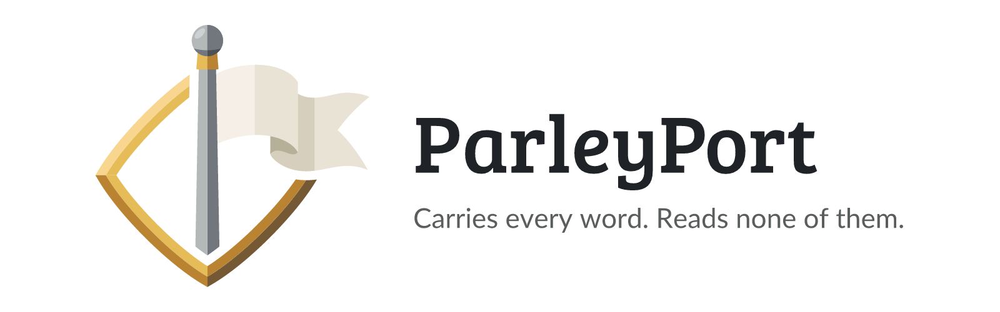

<p align="center">
  <picture>
    <source media="(prefers-color-scheme: dark)" srcset=".github/assets/parleyport-banner-dark.png">
    
  </picture>
</p>

<p align="center">
  <a href="https://github.com/junkerderprovinz/parleyport/actions/workflows/ci.yml"></a>&nbsp;
  <a href="https://github.com/junkerderprovinz/parleyport/actions/workflows/style.yml"></a>&nbsp;
  <a href="https://hub.docker.com/r/junkerderprovinz/parleyport"></a>&nbsp;
  <a href="https://hub.docker.com/r/junkerderprovinz/parleyport"></a>&nbsp;
  <a href="https://github.com/junkerderprovinz/parleyport/pkgs/container/parleyport"></a>&nbsp;
  <a href="https://go.dev"></a>&nbsp;
  <a href="https://unraid.net"></a>&nbsp;
  <a href="LICENSE"></a>
</p>

<br>

<p align="center">
ParleyPort is the relay for <b><a href="https://github.com/junkerderprovinz/knightloader">KnightLoader</a></b> and <b><a href="https://github.com/junkerderprovinz/bombvault">BombVault</a></b>. When two of your instances sit on different networks and neither can reach the other, both dial out to ParleyPort and meet there. It passes their messages on without being able to read them, and it runs as one small container that keeps no accounts and stores nothing.
</p>

<br>

<p align="center">
A one-knight job: I build it, keep it running, work through the issues and add what people ask for, until nothing is missing. It is free, with no accounts, no telemetry, no ads and no paid tier. No asterisk anywhere. Nothing readable ever leaves your own walls. Forged on evenings and weekends, with heart and stubbornness.
</p>

<p align="center">
If it has earned a place on your server or computer, toss a coin to your knight: it helps cover the costs and keeps the project alive. It also makes this knight's heart beat a little faster. Three ways below, whichever suits you.
</p>

<br>

<p align="center">
  <a href="https://buymeacoffee.com/junkerderprovinz"></a>
  &nbsp;
  <a href="https://www.paypal.com/donate/?hosted_button_id=76FVV52TKXTUS"></a>
  &nbsp;
  <a href="https://junkerderprovinz.github.io/junkerderprovinz/"></a>
</p>

<br>

## Table of Contents

1. [What is this?](#1-what-is-this)
2. [Do I need it?](#2-do-i-need-it)
3. [Quick Start on Unraid](#3-quick-start-on-unraid)
4. [Docker and Compose](#4-docker-and-compose)
5. [Configuration](#5-configuration)
6. [Pointing your apps at it](#6-pointing-your-apps-at-it)
7. [What the relay sees](#7-what-the-relay-sees)
8. [Behind a reverse proxy](#8-behind-a-reverse-proxy)
9. [License](#9-license)
10. [How AI is used here](#10-how-ai-is-used-here)
11. [Support this project](#11-support-this-project)

<br>

## 1. What is this?

A parley was a meeting between two sides who did not trust each other, held under a flag of truce at the gate, so nobody had to enter the other's castle. ParleyPort is that gate for your instances.

KnightLoader and BombVault pair their instances with twelve words. Instances on the same network find each other and talk directly. Instances on different networks, behind NAT or a firewall that lets nothing in, need a third point both can dial out to. That point is a relay.

ParleyPort groups the connections that present the same relay key, a hash derived from your twelve words, and forwards their messages between them. Every message is sealed end to end with a key that never leaves your instances, so the relay carries it without being able to open it.

<br>

## 2. Do I need it?

Probably not. There are three ways to reach your instances across networks, and ParleyPort is only one of them:

- **The project relay** at `relay.halleluja.design` is the default in both apps. Nothing to set up.
- **One of your own instances as the relay.** If one KnightLoader or BombVault is already reachable from outside, switch on **Serve as relay** there and the others dial it.
- **ParleyPort**, for when you want your own relay but would rather not put a download manager or a backup tool on the open internet. It is a few megabytes, holds no data and can run on a small VPS while your instances stay at home.

<br>

## 3. Quick Start on Unraid

1. In **Apps**, search for **ParleyPort** and install it.
2. Plain mode: leave the domain empty and map port 8760. Put your reverse proxy in front of it, see [section 8](#8-behind-a-reverse-proxy).
3. Domain mode: enter your domain in **Domain**, forward port 443 on your router to the container, and ParleyPort fetches and renews its own Let's Encrypt certificate. You need neither a proxy nor certbot, and port 80 can stay closed.
4. In each of your apps, set the relay to your address, see [section 6](#6-pointing-your-apps-at-it).

<br>

## 4. Docker and Compose

Plain HTTP for a reverse proxy in front:

```bash
docker run -d --name parleyport --restart unless-stopped \
  -p 8760:8760 \
  junkerderprovinz/parleyport:latest
```

With its own certificate:

```yaml
services:
  parleyport:
    image: junkerderprovinz/parleyport:latest
    container_name: parleyport
    restart: unless-stopped
    ports:
      - "443:443"
    environment:
      PARLEYPORT_DOMAIN: relay.example.org
    volumes:
      - ./parleyport:/var/lib/parleyport
```

The image is also on GHCR as `ghcr.io/junkerderprovinz/parleyport`, for amd64 and arm64. `docker run junkerderprovinz/parleyport -version` prints the version and the commit it was built from.

<br>

## 5. Configuration

Everything comes from the environment. Any command-line argument other than `-version` is refused, so a typo cannot start a relay with settings you did not mean.

| Variable | Default | What it does |
|---|---|---|
| `PARLEYPORT_DOMAIN` | empty | Domain for the built-in certificate. Several names can be given, separated by commas, so an old name keeps working while you move the relay. |
| `PARLEYPORT_ADDR` | `:8760`, or `:443` with a domain | Address and port to listen on. |
| `PARLEYPORT_CERT_DIR` | `/var/lib/parleyport/certs` | Where the certificates are kept. Map `/var/lib/parleyport` to a volume so they survive a restart. |

ParleyPort used to ship inside KnightLoader as `knightloader-relay`. Its old variables `KL_RELAY_DOMAIN`, `KL_RELAY_ADDR` and `KL_RELAY_CERT_DIR` still work, so an existing relay can switch images without touching its configuration.

<br>

## 6. Pointing your apps at it

In KnightLoader and in BombVault the place is the same: **Settings → Pairing → Relay → Own relay**. Enter your address there, on every instance of the group:

- `https://relay.example.org` with a domain or behind a proxy with a certificate
- `http://192.168.1.10:8760` for a relay on your own network, which works, but the app warns you that the relay key then crosses the network unencrypted

The twelve words stay the same. They carry the secret, not the address, so switching relays needs no new pairing.

<br>

## 7. What the relay sees

The relay learns which group a connection belongs to, through a hash of your twelve words and never the words themselves. It also sees which instance a message is for, how large the message is and when it passes.

The content stays closed to it. Messages are sealed with AES-256-GCM under a key derived from the twelve words, and the routing fields are bound into the seal, so a relay cannot redirect a message to another instance either.

It keeps no accounts, no database and no record of who connects. Client addresses are stripped from its own log output, and the rate limiter forgets an address after about an hour.

Whoever runs a relay can still see who talks to whom and when. If that matters to you, run your own, which is what ParleyPort is for.

<br>

## 8. Behind a reverse proxy

Run ParleyPort in plain mode and send `/relay/connect` to port 8760 with WebSocket upgrades allowed. `/health` answers with the status and the version, for a monitor or a health check.

Nginx:

```nginx
location /relay/connect {
    proxy_pass http://parleyport:8760;
    proxy_http_version 1.1;
    proxy_set_header Upgrade $http_upgrade;
    proxy_set_header Connection "upgrade";
    proxy_read_timeout 1h;
}
```

Nginx Proxy Manager: add a proxy host for your domain pointing at port 8760 and switch on **Websockets Support**.

<br>

## 9. License

**Copyright (C) 2026 Junker der Provinz.**

ParleyPort is free software under the **GNU Affero General Public License v3.0** (AGPL-3.0); see [LICENSE](LICENSE). You may run, study, share and modify it. If you distribute it, or run a modified version as a network service, you must release your source under the same AGPL-3.0 terms and keep the existing copyright and attribution notices intact.

**Name and branding are not licensed.** The AGPL covers the source code only. "ParleyPort", its logo and its branding remain reserved: a fork or derivative must use its own distinct name and branding, and may not present itself as ParleyPort. This keeps it unambiguous which project is the original.

<br>

## 10. How AI is used here

One knight builds this, and AI is one of the tools I work with, the same way I work with an editor or a compiler. It helps me write code and documentation and it checks my work, and that saves me a good many evenings. It does not make the decisions, though. I read and understand everything before it ships, and if something here breaks, that is on me and not on the tool.

You do not have to take my word for it. The code is open and every release note is written by hand. The issue tracker shows how problems actually get handled, including the ones I got wrong the first time. If you find something that is not right, open an issue and I will look at it.

<br>

## 11. Support this project

Bugs, ideas or feature requests? Please [open a GitHub issue](https://github.com/junkerderprovinz/parleyport/issues).

A one-knight job: I build it, keep it running, work through the issues and add what people ask for, until nothing is missing. It is free, with no accounts, no telemetry, no ads and no paid tier. No asterisk anywhere. Nothing readable ever leaves your own walls. Forged on evenings and weekends, with heart and stubbornness.

If it has earned a place on your server or computer, toss a coin to your knight: it helps cover the costs and keeps the project alive. It also makes this knight's heart beat a little faster. Three ways below, whichever suits you.

<p align="center">
  <a href="https://buymeacoffee.com/junkerderprovinz"></a>
  &nbsp;
  <a href="https://www.paypal.com/donate/?hosted_button_id=76FVV52TKXTUS"></a>
  &nbsp;
  <a href="https://junkerderprovinz.github.io/junkerderprovinz/"></a>
</p>
