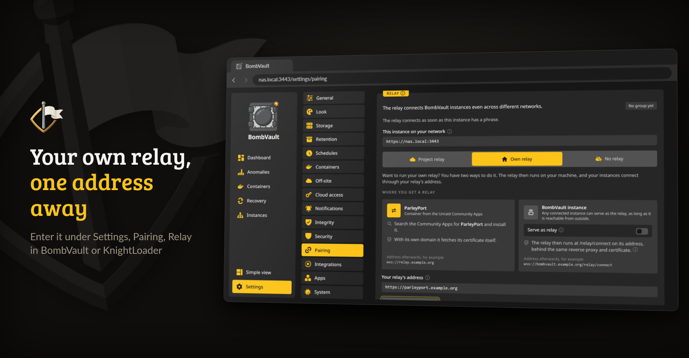
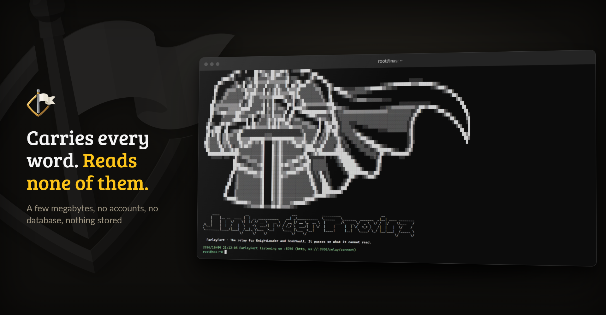

<p align="center">
  <picture>
    <source media="(prefers-color-scheme: dark)" srcset=".github/assets/parleyport-banner-dark.png">
    
  </picture>
</p>

<p align="center">
  <a href="https://github.com/junkerderprovinz/parleyport/actions/workflows/ci.yml"></a>&nbsp;
  <a href="https://github.com/junkerderprovinz/parleyport/actions/workflows/style.yml"></a>&nbsp;
  <a href="https://hub.docker.com/r/junkerderprovinz/parleyport"></a>&nbsp;
  <a href="https://hub.docker.com/r/junkerderprovinz/parleyport"></a>&nbsp;
  <a href="https://github.com/junkerderprovinz/parleyport/pkgs/container/parleyport"></a>&nbsp;
  <a href="https://go.dev"></a>&nbsp;
  <a href="https://ca.unraid.net/apps/parleyport-1ucelx3086hypv"></a>&nbsp;
  <a href="LICENSE"></a>
</p>

<p align="center">
ParleyPort is the relay for <b><a href="https://github.com/junkerderprovinz/knightloader">KnightLoader</a></b> and <b><a href="https://github.com/junkerderprovinz/bombvault">BombVault</a></b>. When two of your instances sit on different networks and neither can reach the other, both dial out to ParleyPort and meet there. It passes their messages on without being able to read them, and it runs as one small container that keeps no accounts and stores nothing.
</p>

<!-- download-buttons: written by scripts/gen_download_buttons.py -->
<p align="center">
  <a href="https://ca.unraid.net/apps/parleyport-1ucelx3086hypv"></a>
  &nbsp;
  <a href="https://hub.docker.com/r/junkerderprovinz/parleyport/"></a>
  &nbsp;
  <a href="https://github.com/junkerderprovinz/parleyport/releases/latest"></a>
</p>
<!-- /download-buttons -->

<br>

<p align="center">
A one-knight job: I build it, keep it running, work through the issues and add what people ask for, until nothing is missing. It is free, with no accounts, no telemetry, no ads and no paid tier. No asterisk anywhere. Nothing readable ever leaves your own walls. Forged on evenings and weekends, with heart and stubbornness.
</p>

<p align="center">
If it has earned a place on your server or computer, toss a coin to your knight: it helps cover the costs and keeps the project alive. It also makes this knight's heart beat a little faster. Three ways below, whichever suits you.
</p>

<!-- give-buttons: written by scripts/gen_download_buttons.py -->
<p align="center">
  <a href="https://buymeacoffee.com/junkerderprovinz"></a>
  &nbsp;
  <a href="https://www.paypal.com/donate/?hosted_button_id=76FVV52TKXTUS"></a>
  &nbsp;
  <a href="https://junkerderprovinz.github.io/junkerderprovinz/"></a>
</p>
<!-- /give-buttons -->

<br>

## Table of Contents

1. [What it looks like](#1-what-it-looks-like)
2. [What it does](#2-what-it-does)
3. [Getting started](#3-getting-started)
4. [How AI is used here](#4-how-ai-is-used-here)
5. [Support this project](#5-support-this-project)

<br>

## 1. What it looks like

ParleyPort has no web page of its own. What you see of it is the relay setting in your apps and the container's log.

<p align="center">
  
  <br><em>BombVault's relay card pointing at your own ParleyPort; KnightLoader has the same card</em>
</p>

<p align="center">
  
  <br><em>The container's log after a start: ready and listening</em>
</p>

<br>

## 2. What it does

KnightLoader and BombVault pair their instances with twelve words. Instances on the same network talk directly. Instances on different networks, behind NAT or a firewall that lets nothing in, need a third point both can dial out to, and that point is a relay. ParleyPort groups the connections that present the same relay key, a hash of your twelve words, and passes their messages between them.

- **It cannot read what it carries.** Every message is sealed with AES-256-GCM under a key derived from the twelve words, and the routing fields are bound into the seal, so a relay can neither open a message nor send it to another instance.
- **It keeps nothing.** No accounts, no database and no record of who connects. Client addresses are left out of its log. What any relay can still see is which instances talk and when, which is the reason to run your own.
- **It brings its own certificate.** Give it a domain and it fetches and renews a Let's Encrypt certificate on port 443, with port 80 left closed. Without a domain it serves plain HTTP on port 8760 for a reverse proxy in front.
- **It is small.** A few megabytes for amd64 and arm64, fine on a small VPS while your instances stay at home.

You probably do not need it: the project relay is the default in both apps, and an instance that is already reachable from outside can serve as the relay itself under **Serve as relay**. ParleyPort is for your own relay without putting a download manager or a backup tool on the open internet.

<br>

## 3. Getting started

On Unraid, install **ParleyPort** from [Community Applications](https://ca.unraid.net/apps/parleyport-1ucelx3086hypv). Anywhere else, for a reverse proxy in front:

```sh
docker run -d --name parleyport -p 8760:8760 junkerderprovinz/parleyport:latest
```

The proxy sends `/relay/connect` to port 8760 with WebSocket upgrades allowed (in Nginx Proxy Manager, switch on **Websockets Support**). To let ParleyPort handle TLS itself instead, set `PARLEYPORT_DOMAIN`, forward port 443 to it and keep its certificates on a volume:

```sh
docker run -d --name parleyport -p 443:443 \
  -e PARLEYPORT_DOMAIN=relay.example.org \
  -v /path/to/parleyport:/var/lib/parleyport \
  junkerderprovinz/parleyport:latest
```

Then, on every instance of the group, open **Settings, Pairing, Relay, Own relay** and enter the address, for example `https://relay.example.org`. The twelve words stay the same, so switching relays needs no new pairing. A relay that ran from the old `knightloader-relay` image can switch images as it is, since ParleyPort still reads its `KL_RELAY_*` variables.

<br>

## 4. How AI is used here

One knight builds this, and AI is one of the tools I work with, the same way I work with an editor or a compiler. It helps me write code and documentation and it checks my work, and that saves me a good many evenings. It does not make the decisions, though. I read and understand everything before it ships, and if something here breaks, that is on me and not on the tool.

You do not have to take my word for it. The code is open and every release note is written by hand. The issue tracker shows how problems actually get handled, including the ones I got wrong the first time. If you find something that is not right, open an issue and I will look at it.

<br>

## 5. Support this project

Bugs, ideas or feature requests? Please [open a GitHub issue](https://github.com/junkerderprovinz/parleyport/issues).

A one-knight job: I build it, keep it running, work through the issues and add what people ask for, until nothing is missing. It is free, with no accounts, no telemetry, no ads and no paid tier. No asterisk anywhere. Nothing readable ever leaves your own walls. Forged on evenings and weekends, with heart and stubbornness.

If it has earned a place on your server or computer, toss a coin to your knight: it helps cover the costs and keeps the project alive. It also makes this knight's heart beat a little faster. Three ways below, whichever suits you.

<!-- give-buttons: written by scripts/gen_download_buttons.py -->
<p align="center">
  <a href="https://buymeacoffee.com/junkerderprovinz"></a>
  &nbsp;
  <a href="https://www.paypal.com/donate/?hosted_button_id=76FVV52TKXTUS"></a>
  &nbsp;
  <a href="https://junkerderprovinz.github.io/junkerderprovinz/"></a>
</p>
<!-- /give-buttons -->

<br>

<sub>The name ParleyPort, its logo and its branding are not covered by the AGPL-3.0 licence of the code: a fork needs its own name and look.</sub>
